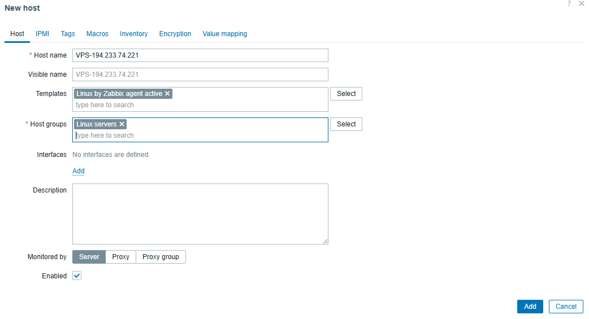

# Hướng dẫn setup Agent cho VPS thực hiện monitor và gửi dữ liệu về hệ thống giám sát
Để thiết lập một Agent trên VPS nhằm thực hiện việc giám sát và gửi dữ liệu về hệ thống giám sát, bạn có thể làm theo các bước sau:

## Bước 1: Chuẩn bị môi trường
1. Đảm bảo VPS của bạn đã được cài đặt hệ điều hành (ví dụ: Ubuntu, CentOS).
2. Cập nhật hệ thống và cài đặt các gói cần thiết:
   ```bash
   sudo apt update && sudo apt upgrade -y  # Dành cho Ubuntu/Debian
   sudo yum update -y                      # Dành cho CentOS/RHEL
   ```
3. Cài đặt các công cụ cần thiết như `curl`, `wget`, hoặc `git` nếu chưa có:
   ```bash
   sudo apt install curl wget git -y      # Dành cho Ubuntu/Debian
   sudo yum install curl wget git -y      # Dành cho CentOS/RHEL
   ```
4. Tiến hành cài đặt zabbix-agent2
    ```bash
    # Dành cho Ubuntu/Debian
    wget https://repo.zabbix.com/zabbix/6.0/ubuntu/pool/main/z/zabbix-release/zabbix-release_6.0-1+ubuntu20.04_all.deb
    sudo dpkg -i zabbix-release_6.0-1+ubuntu20.04_all.deb
    sudo apt update
    sudo apt install zabbix-agent2 -y
    
    # Dành cho CentOS/RHEL
    rpm -Uvh https://repo.zabbix.com/zabbix/6.0/rhel/7/x86_64/zabbix-release-6.0-1.el7.noarch.rpm
    yum clean all
    yum install zabbix-agent2 -y
    ```
5. Chỉnh sửa file cấu hình của zabbix-agent2 để kết nối với server Zabbix
    ```bash
    sudo nano /etc/zabbix/zabbix_agent2.conf
    ```
    Tìm và chỉnh sửa các dòng sau:
    ```
    Server=<IP_or_Hostname_of_Zabbix_Server>
    ServerActive=<IP_or_Hostname_of_Zabbix_Server>
    Hostname=<Unique_Hostname_for_This_Agent>
    ```
6. Lưu và đóng file cấu hình.
7. Khởi động và kích hoạt dịch vụ zabbix-agent2 để nó tự động chạy khi khởi động hệ thống:
    ```bash
    sudo systemctl start zabbix-agent2
    sudo systemctl enable zabbix-agent2
    ```
8. Kiểm tra trạng thái của dịch vụ để đảm bảo nó đang chạy:
    ```bash
    sudo systemctl status zabbix-agent2
    ```
9. Đăng nhập vào giao diện quản trị của Zabbix Server và thêm host mới với hostname đã cấu hình ở bước 5.

    Truy cập vào phần "Configuration" -> "Hosts" -> "Create host" và điền các thông tin cần thiết như tên host, nhóm host, và địa chỉ IP của VPS.

10. Kiểm tra dữ liệu giám sát từ host mới thêm vào để đảm bảo agent hoạt động đúng cách.
11. Nếu cần, bạn có thể cấu hình thêm các item, trigger, và graph trên Zabbix Server để phù hợp với nhu cầu giám sát của bạn.
12. Hoàn tất quá trình thiết lập và giám sát VPS của bạn thông qua Zabbix Agent.
13. Chúc mừng! Bạn đã hoàn thành việc thiết lập Agent trên VPS để giám sát và gửi dữ liệu về hệ thống giám sát.
